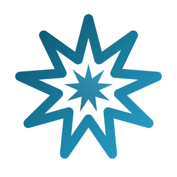

# Nine Point Labs

---

### ✦ Hi, I'm Tim

Combat veteran, semi-retired technologist, Tae Kwon Do dad in East Texas. I write some of the code and direct a small crew of AI agents for the rest. They're named after Ted Lasso characters. No, I will not be taking questions.

**Why nine?** In the Bahá'í Faith, nine is the number of completeness and unity, hence the nine-pointed star.

### ✦ The Workshop

<table>
<tr><td width="50%" valign="top">

🔐 **[Omostrich](https://github.com/ninepointlabs/omostrich)** 
Local Nostr key-custody daemon. Your `nsec` stays home; signing happens over a socket and NIP-46.
 `QML` · `Nostr`

</td><td width="50%" valign="top">

🗄️ **[Persistwise](https://ninepointlabs.com/projects)** 
Makes your writing *last*. Every new post archived to the Wayback Machine, IPFS and your own disk.
 `Rails 8` · `SQLite` · `Solid Queue`

</td></tr>
<tr><td width="50%" valign="top">

🍺 **[barkeep](https://github.com/ninepointlabs/barkeep)** 
Tends your Omarchy bar. Arrange, pin, update and remove every other plugin from one overlay.
 `QML` · `Omarchy`

</td><td width="50%" valign="top">

📬 **[fm-cli](https://github.com/ninepointlabs/fm-cli)** 
Minimalist TUI email client for Fastmail, spoken fluently in JMAP.
 `Go` · `TUI`

</td></tr>
</table>

<b>🧩 Omarchy plugins</b>: the bar is crowded and I regret nothing

 

[omarchy-spotify](https://github.com/ninepointlabs/omarchy-spotify) ·
[omarchy-fastmail-calendar](https://github.com/ninepointlabs/omarchy-fastmail-calendar) ·
[omarchy-fastmail](https://github.com/ninepointlabs/omarchy-fastmail) ·
[omarchy-ring-cameras](https://github.com/ninepointlabs/omarchy-ring-cameras) ·
[omarchy-upcoming](https://github.com/ninepointlabs/omarchy-upcoming) ·
[omarchy-theme-rotate](https://github.com/ninepointlabs/omarchy-theme-rotate) ·
[omarchy-hermes-chat](https://github.com/ninepointlabs/omarchy-hermes-chat) ·
[omarchy-hey-calendar](https://github.com/ninepointlabs/omarchy-hey-calendar)

**Just for fun:** [Zork I–III](https://github.com/ninepointlabs/omarchy-zorkmachy) ·
[dopewars](https://github.com/ninepointlabs/omarchy-dopewars) ·
[US Army theme](https://github.com/ninepointlabs/omarchy-theme-us-army) ·
[Ted Lasso theme](https://github.com/ninepointlabs/omarchy-ted-lasso-theme) (Believe.) ·
[nene-royal](https://github.com/ninepointlabs/omarchy-nene-royal) (got out of hand)

<b>⌨️ Terminal tools</b>: CLIs that live where they belong

 

[autonomix-cli](https://github.com/ninepointlabs/autonomix-cli) Obtainium for the command line ·
[tfz](https://github.com/ninepointlabs/tfz) RSS that renders the *full* article ·
[rjrnl](https://github.com/ninepointlabs/rjrnl) friendly journaling ·
[writeapp](https://github.com/ninepointlabs/writeapp) distraction-free writing ·
[sendit-cli](https://github.com/ninepointlabs/sendit-cli) cross-posting, because copy-paste is for chumps ·
[mb-cli](https://github.com/ninepointlabs/mb-cli) Micro.blog posting ·
[rubdupe](https://github.com/ninepointlabs/rubdupe) written the week I ran out of disk again

<b>📱 Apps & applets</b>: Flutter and COSMIC odds and ends

 

[jrnl-droid](https://github.com/ninepointlabs/jrnl-droid) ·
[Primal-Pal](https://github.com/ninepointlabs/Primal-Pal) ·
[doh](https://github.com/ninepointlabs/doh) ·
[cosmic-applet-keyguide](https://github.com/ninepointlabs/cosmic-applet-keyguide) ·
[MB-Manager](https://github.com/ninepointlabs/MB-Manager) ·
[trekkie](https://github.com/ninepointlabs/trekkie) 🖖 (archived, still correct)

### ✦ On the Bench

- 📅 Finishing **[omarchy-fastmail-calendar](https://github.com/ninepointlabs/omarchy-fastmail-calendar)**, a native CalDAV calendar for any server
- 🛤️ Rebuilding **[ninepointlabs.com](https://ninepointlabs.com)** in Rails 8, with an MCP server so the agents can post without me
- 💡 Whatever idea won't leave me alone this week

 

  

Linux user who will absolutely judge your OS choice, then offer to help you switch distros anyway.

